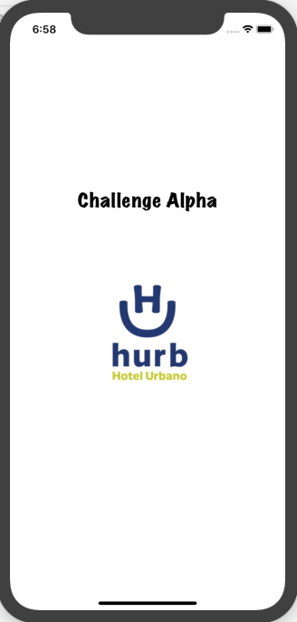
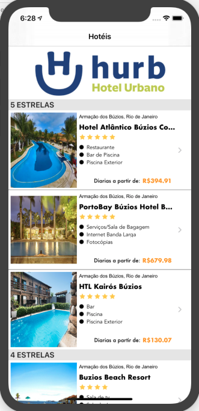
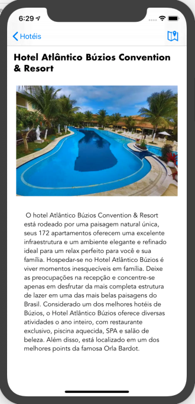
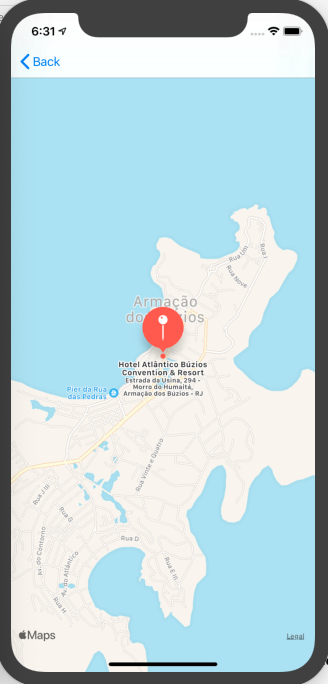

# Desafio Hotel Urbano

Aplicativo para dispositivo iOS (Swift) que consome o JSON exposto pela API de busca do Hurb e apresenta as informações em uma listagem. 

<table>
  <tbody>
    <tr>
      <td>  </td>
      <td>  </td>
      
   
  </tbody>
</table>

# Novas Features
Ao tocar em uma celula o app abre uma pagina de detalhe exibindo o Nome do Hotel, foto em maior tamanho e descrição. 
Na tela de detalhe é possivel ver a localização do Hotel no Mapa tocando no icone no canto superior direito.

<table>
  <tbody>
    <tr>
      <td>  </td>
      <td>  </td>
    
    
  </tbody>
</table>
